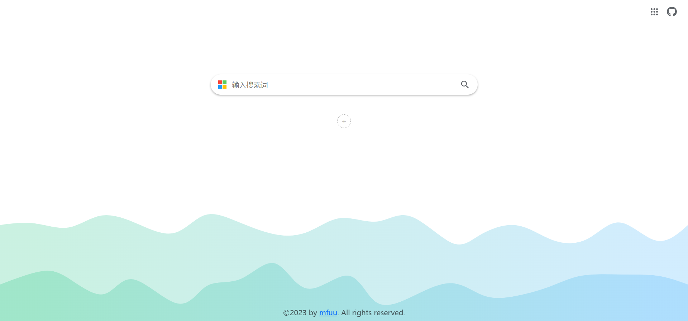
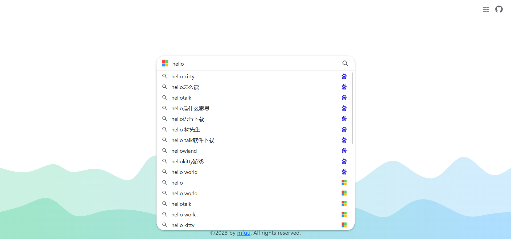
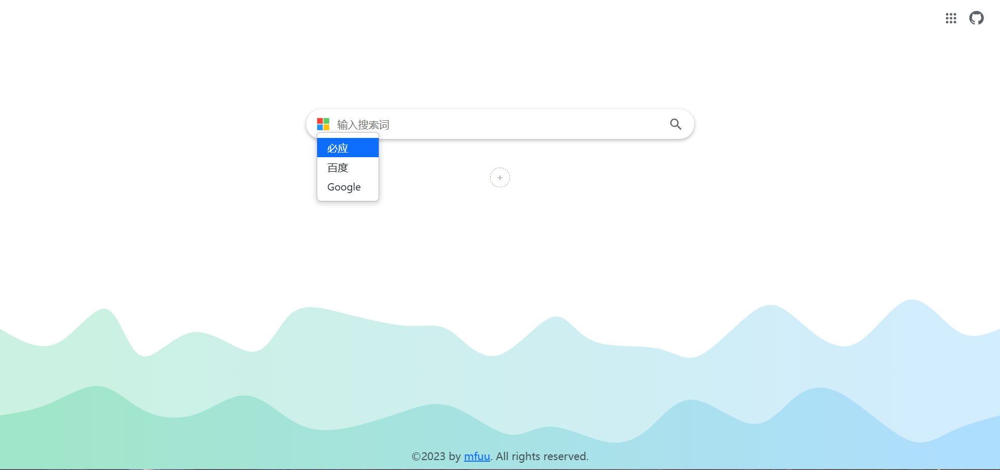
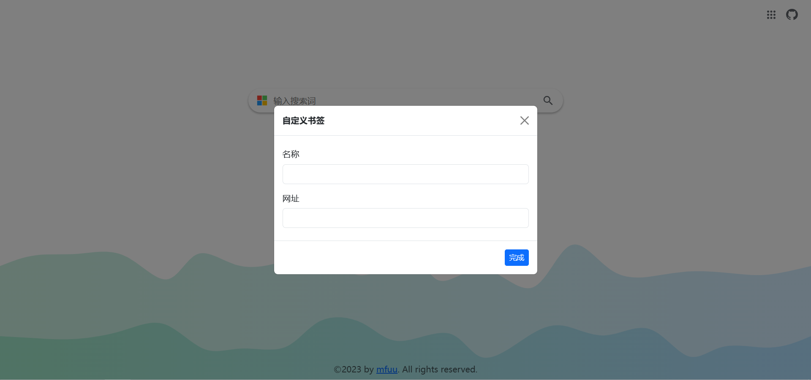
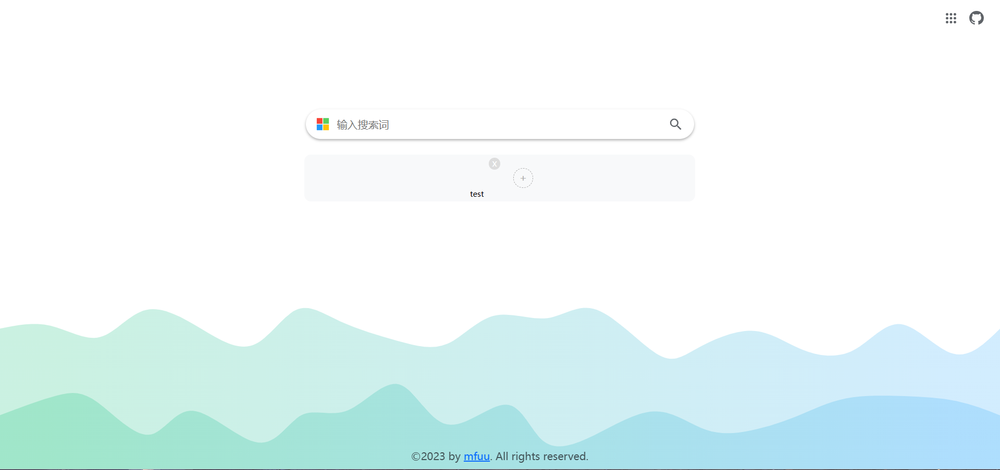

# 搜索引擎整合
## 整合百度、必应、谷歌等多个搜索引擎
- 在搜索框中输入关键词后，会显示下拉菜单，列出三个搜索引擎的关键词联想问题
- 可以选择联想问题进行跳转，也可以切换搜索引擎，跳转到搜索输入的关键词
- 点击中间的加号可以添加网址，鼠标右键点击可以编辑网址

> 效果图：

# Integrated Search Engines
## Integration of various search engines including Baidu, Bing, Google, and others
- Upon entering keywords in the search box, a dropdown menu will appear, listing keyword suggestions from three search engines
- You can choose a suggested question to navigate to, or switch between search engines to navigate to the inputted keywords
- Clicking the plus icon in the middle allows you to add a website URL; right-clicking the icon enables URL editing

> Screenshot:

